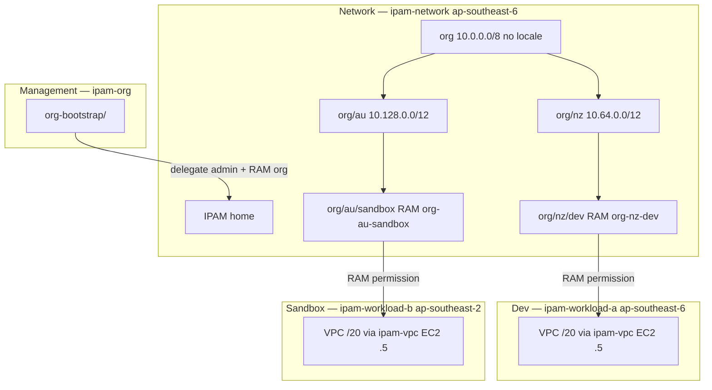
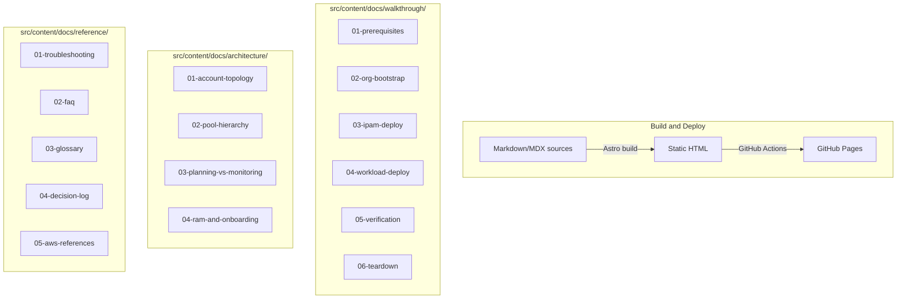
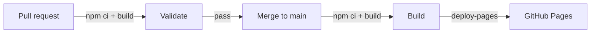
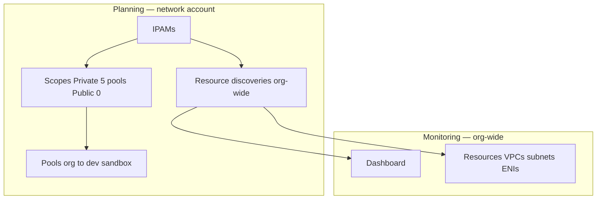

# Design Document

Reference requirements: [requirements.md](requirements.md).  
Canonical upstream content: [`tfstack/terraform-aws-ipam` — WALKTHROUGH.md](https://github.com/tfstack/terraform-aws-ipam/blob/main/.kiro/specs/multi-account-example/WALKTHROUGH.md).

## Overview

This design describes a documentation-only static site built with Astro/Starlight. It teaches platform engineers how to deploy and operate the IPAM multi-account Terraform example from `tfstack/terraform-aws-ipam` (`examples/multi-account/`).

The site covers a four-account, multi-region AWS Organizations IPAM deployment using an ANZ regional pattern (NZ primary `ap-southeast-6`, AU secondary `ap-southeast-2`). Content is operational reference — no presenter script, demo narration, or “say aloud” phrasing.

The site is content-only: no server runtime, no authentication, no dynamic data. It produces static HTML deployed to GitHub Pages via GitHub Actions (`upload-pages-artifact` + `deploy-pages`).

### Design Decisions

| Decision                              | Rationale                                                                            |
| ------------------------------------- | ------------------------------------------------------------------------------------ |
| Astro + Starlight                     | Docs framework with sidebar nav, search, dark mode, and accessibility                |
| Starlight Asides                      | Native `:::note`, `:::tip`, `:::caution`, `:::danger` — no custom callout components |
| `remark-mermaidjs`                    | Build-time SVG rendering; invalid syntax fails the build                             |
| Three content domains                 | Walkthrough (operational), Architecture (design), Reference (lookup)                 |
| Single-purpose pages                  | Shorter pages improve scanning; map 1:1 to upstream WALKTHROUGH sections             |
| Upstream WALKTHROUGH as source        | Avoid drift; port content from `.kiro/specs/multi-account-example/WALKTHROUGH.md`    |
| FINDINGS cross-linked, not copied     | Empirical apply errors stay in upstream `examples/multi-account/FINDINGS.md`         |
| Source version declaration on landing | Pins content to upstream module release or commit ref                                |
| Placeholder IDs in all examples       | Real account/pool IDs live in operator gitignored `terraform.tfvars` only            |
| Manual `terraform.tfvars` contract    | Mirrors upstream — no `terraform_remote_state` between stacks                        |
| Pool-backed VPC via `ipam-vpc`        | Documents `ipv4_ipam_pool_id` pattern; preview + static CIDR noted as superseded     |

## Documented System (Upstream Example)

The Site documents this Terraform layout — not the Astro project itself.



### Three onboarding layers (content model)

| Layer                   | Stack                         | Mechanism                                               | Site page                  |
| ----------------------- | ----------------------------- | ------------------------------------------------------- | -------------------------- |
| 1. Org IPAM integration | `org-bootstrap/`              | `aws_vpc_ipam_organization_admin_account`               | `02-org-bootstrap.md`      |
| 2. Pool access (RAM)    | `ipam/`                       | `ram_share_principals` → `org-nz-dev`, `org-au-sandbox` | `04-ram-and-onboarding.md` |
| 3. Consumption          | `workload-a/` / `workload-b/` | `pool_id` + `modules/ipam-vpc/` (`ipv4_ipam_pool_id`)   | `04-workload-deploy.md`    |

### Planning vs Monitoring (two-plane model)

| Plane          | Console                                            | Driven by                                      | Site page                                            |
| -------------- | -------------------------------------------------- | ---------------------------------------------- | ---------------------------------------------------- |
| **Planning**   | IPAMs, Scopes, Pools, Allocations, Resource shares | `ipam/` + workload allocations                 | `03-planning-vs-monitoring.md`                       |
| **Monitoring** | Dashboard, Resources, ENIs                         | Org delegation + resource discovery (org-wide) | `05-verification.md`, `03-planning-vs-monitoring.md` |

RAM share grants **permission**. **IPAM allocation** (Managed VPC) requires `ipv4_ipam_pool_id`. **Monitoring** inventories all org member resources — not filtered by pools in `ipam/main.tf`.

## Site Architecture



### Upstream content mapping

| Upstream WALKTHROUGH section            | Site page(s)                                   |
| --------------------------------------- | ---------------------------------------------- |
| Story, Overview and success criteria    | `index.mdx`                                    |
| Architecture (mermaid)                  | `architecture/01-account-topology.md`          |
| Glossary                                | `reference/03-glossary.md`                     |
| Decision log                            | `reference/04-decision-log.md`                 |
| Pools vs monitoring, IPAM console map   | `architecture/03-planning-vs-monitoring.md`    |
| Workload onboarding, IPAM relies on RAM | `architecture/04-ram-and-onboarding.md`        |
| Prerequisites and pre-flight            | `walkthrough/01-prerequisites.md`              |
| IPAM vs host IP                         | `walkthrough/05-verification.md` (ENI section) |
| Apply order                             | `walkthrough/02–04`                            |
| Post-apply verification                 | `walkthrough/05-verification.md`               |
| Troubleshooting                         | `reference/01-troubleshooting.md`              |
| Trade-offs FAQ                          | `reference/02-faq.md`                          |
| Teardown order                          | `walkthrough/06-teardown.md`                   |
| CIDR allocation plan                    | `architecture/02-pool-hierarchy.md`            |
| AWS references                          | `reference/05-aws-references.md`               |
| FINDINGS (empirical errors)             | Link only — do not duplicate                   |

### Build pipeline



## Components and Interfaces

### Project root configuration

| File                      | Purpose                                                                |
| ------------------------- | ---------------------------------------------------------------------- |
| `package.json`            | Dependencies: `astro`, `@astrojs/starlight`, `remark-mermaidjs`        |
| `astro.config.mjs`        | Starlight integration, sidebar groups, site URL, Mermaid remark plugin |
| `tsconfig.json`           | TypeScript strict mode for any `.ts` utilities                         |
| `.vscode/cspell.json`     | Code Spell Checker dictionary (IPAM, Astro, Terraform terms)           |
| `.vscode/extensions.json` | Recommended extensions: Astro, Prettier, Code Spell Checker            |
| `.vscode/settings.json`   | Format on save, cSpell config path                                     |
| `.vscode/tasks.json`      | `dev` and `build` npm tasks                                            |

### Astro configuration (`astro.config.mjs`)

```javascript
import { defineConfig } from "astro/config";
import starlight from "@astrojs/starlight";
import remarkMermaid from "remark-mermaidjs";

export default defineConfig({
  site: "https://<owner>.github.io",
  base: "/amazon-vpc-ipam-multi-account-walkthrough",
  markdown: {
    remarkPlugins: [remarkMermaid],
  },
  integrations: [
    starlight({
      title: "IPAM Multi-Account Walkthrough",
      social: {
        github:
          "https://github.com/<owner>/amazon-vpc-ipam-multi-account-walkthrough",
      },
      sidebar: [
        {
          label: "Getting Started",
          items: [{ label: "Overview", slug: "index" }],
        },
        {
          label: "Walkthrough",
          autogenerate: { directory: "walkthrough" },
        },
        {
          label: "Architecture",
          autogenerate: { directory: "architecture" },
        },
        {
          label: "Reference",
          autogenerate: { directory: "reference" },
        },
      ],
    }),
  ],
});
```

### Content page structure

Each page uses Starlight frontmatter:

```markdown
---
title: Verification
description: Confirm pool allocations, Managed VPCs, and ENI visibility
sidebar:
  order: 5
---
```

Apply-related walkthrough pages include a footer block linking upstream:

```markdown
> **Upstream:** [examples/multi-account/](https://github.com/tfstack/terraform-aws-ipam/tree/main/examples/multi-account/)
```

### Callout system (Starlight Asides)

```markdown
:::danger[Organizations-level change]
Delegates IPAM admin and enables RAM org sharing. Run only from the management account (`ipam-org`).
:::

:::caution[Credential context]
Run `aws sts get-caller-identity` with `ipam-network` before applying `ipam/`.
:::

:::caution[Dashboard sync]
Allocations update first; Monitoring → Dashboard may lag by hours and includes org-wide legacy VPCs.
:::

:::tip[Optional]
Keep `org-bootstrap/` in place between test iterations.
:::
```

| Severity  | Use when                                                             |
| --------- | -------------------------------------------------------------------- |
| `danger`  | Org delegation, RAM org sharing, irreversible org config             |
| `caution` | Profile switches, SSO pre-checks, destroy ordering, dashboard lag    |
| `tip`     | Optional practices (filter Resources by account, keep org-bootstrap) |
| `note`    | Neutral context (Public scope empty, preview pattern superseded)     |

### Mermaid diagrams

Required diagrams (authored as fenced `mermaid` blocks):

1. **Four-account topology** — management, network, dev, sandbox + RAM (architecture/01)
2. **Pool hierarchy** — `org` → regional → leaf with CIDRs and locales (architecture/02)
3. **IPAM console map** — Planning vs Monitoring + Terraform stack inputs (architecture/03)
4. **RAM flow** — org-bootstrap → ipam → resource shares → workloads (architecture/04)

Example — IPAM console map (from upstream WALKTHROUGH):

````markdown

````

### Source version declaration

Landing page (`src/content/docs/index.mdx`):

```markdown
> **Source version:** `tfstack/terraform-aws-ipam` @ `v1.x.x` (or commit SHA)
> [Module source](https://github.com/tfstack/terraform-aws-ipam) |
> [Example path](https://github.com/tfstack/terraform-aws-ipam/tree/main/examples/multi-account/) |
> [Upstream WALKTHROUGH](https://github.com/tfstack/terraform-aws-ipam/blob/main/.kiro/specs/multi-account-example/WALKTHROUGH.md)
```

### Sensitive data in authored content

| Allowed in Site                                        | Forbidden in Site                           |
| ------------------------------------------------------ | ------------------------------------------- |
| `111111111111`, `222222222222` placeholder account IDs | Real 12-digit account IDs from applies      |
| `ipam-pool-0123456789abcdef0`                          | Live `ipam-pool-*` IDs from operator tfvars |
| Profile names `ipam-org`, `ipam-network`, …            | Real org IDs (`o-…`)                        |
| CIDR plan from `ipam/main.tf`                          | SSO session names tied to a specific org    |

Operators copy real values into gitignored `terraform.tfvars` locally (matching upstream `.gitignore`).

### GitHub Actions workflows

**`.github/workflows/deploy.yml`** — build and deploy on merge to `main`:

```yaml
name: Deploy to GitHub Pages

on:
  push:
    branches: [main]

permissions:
  contents: read
  pages: write
  id-token: write

jobs:
  build:
    runs-on: ubuntu-latest
    steps:
      - uses: actions/checkout@v4
      - uses: actions/setup-node@v4
        with:
          node-version: 20
          cache: npm
      - run: npm ci
      - run: npm run build
      - uses: actions/upload-pages-artifact@v3
        with:
          path: dist/

  deploy:
    needs: build
    runs-on: ubuntu-latest
    environment:
      name: github-pages
      url: ${{ steps.deployment.outputs.page_url }}
    steps:
      - id: deployment
        uses: actions/deploy-pages@v4
```

**`.github/workflows/validate.yml`** — lint and build on pull requests:

```yaml
name: Validate

on:
  pull_request:
    branches: [main]

jobs:
  validate:
    runs-on: ubuntu-latest
    steps:
      - uses: actions/checkout@v4
      - uses: actions/setup-node@v4
        with:
          node-version: 20
          cache: npm
      - run: npm ci
      - run: npm run build
      # Optional: markdownlint with same rules as terraform-aws-ipam CI
      # - run: npx markdownlint-cli 'src/content/**/*.md'
```

### Directory layout

```text
.
├── .github/workflows/
│   ├── deploy.yml
│   └── validate.yml
├── .kiro/
│   ├── specs/
│   └── steering/               # Workspace steering (e.g. editor-tooling.md)
├── .vscode/
│   ├── cspell.json             # Spell-check dictionary
│   ├── extensions.json         # Recommended extensions
│   ├── settings.json           # Editor defaults
│   └── tasks.json              # dev / build tasks
├── public/images/              # Optional console screenshots
├── src/content/docs/
│   ├── index.mdx               # Landing: story, success criteria, version pin
│   ├── walkthrough/
│   │   ├── 01-prerequisites.md       # SSO, profiles, get-caller-identity
│   │   ├── 02-org-bootstrap.md       # Delegation + RAM org sharing
│   │   ├── 03-ipam-deploy.md         # Pools, RAM shares, outputs
│   │   ├── 04-workload-deploy.md     # pool_id contract, ipam-vpc apply
│   │   ├── 05-verification.md        # Allocations, Managed, ENIs, dashboard
│   │   └── 06-teardown.md            # Reverse order; org-bootstrap optional
│   ├── architecture/
│   │   ├── 01-account-topology.md
│   │   ├── 02-pool-hierarchy.md      # CIDR plan table, root pool no locale
│   │   ├── 03-planning-vs-monitoring.md  # Console map, dashboard widgets
│   │   └── 04-ram-and-onboarding.md    # Three layers, ipam-vpc, RAM vs allocation
│   └── reference/
│       ├── 01-troubleshooting.md
│       ├── 02-faq.md
│       ├── 03-glossary.md
│       ├── 04-decision-log.md
│       └── 05-aws-references.md
├── astro.config.mjs
├── package.json
└── tsconfig.json
```

Numeric filename prefixes control sidebar order within each `autogenerate` group.

## Static Content Models

No runtime data models. Content uses fixed tables aligned with upstream example.

### Success criteria (landing page)

Deployment succeeds when all are true:

- Leaf pools `org/nz/dev` and `org/au/sandbox` exist with expected CIDRs and locales
- RAM shares `org-nz-dev` and `org-au-sandbox` are Active
- Workload VPCs are **Managed** via `ipv4_ipam_pool_id`
- Planning → Pools → **Allocations** shows `/20` blocks owned by workload accounts
- Monitoring → Resources → ENIs shows `10.64.0.5` and `10.128.0.5`

### CIDR plan

| Pool path        | CIDR            | Locale           | RAM share                  | Workload output               |
| ---------------- | --------------- | ---------------- | -------------------------- | ----------------------------- |
| `org`            | `10.0.0.0/8`    | —                | —                          | —                             |
| `org/nz`         | `10.64.0.0/12`  | `ap-southeast-6` | —                          | —                             |
| `org/au`         | `10.128.0.0/12` | `ap-southeast-2` | —                          | —                             |
| `org/nz/dev`     | `10.64.0.0/16`  | `ap-southeast-6` | `org-nz-dev` → Dev         | VPC `10.64.0.0/20`, EC2 `.5`  |
| `org/au/sandbox` | `10.128.0.0/16` | `ap-southeast-2` | `org-au-sandbox` → Sandbox | VPC `10.128.0.0/20`, EC2 `.5` |

### Stack execution context

| Stack            | Account    | Profile           | Region           | Order             |
| ---------------- | ---------- | ----------------- | ---------------- | ----------------- |
| `org-bootstrap/` | Management | `ipam-org`        | — (global)       | 1st               |
| `ipam/`          | Network    | `ipam-network`    | `ap-southeast-6` | 2nd               |
| `workload-a/`    | Dev        | `ipam-workload-a` | `ap-southeast-6` | 3rd (parallel OK) |
| `workload-b/`    | Sandbox    | `ipam-workload-b` | `ap-southeast-2` | 3rd (parallel OK) |

Destroy: workloads → `ipam/` → optionally `org-bootstrap/`.

### Stack contract

| IPAM output          | Workload input | File                                       |
| -------------------- | -------------- | ------------------------------------------ |
| `nz_dev_pool_id`     | `pool_id`      | `workload-a/terraform.tfvars` (gitignored) |
| `au_sandbox_pool_id` | `pool_id`      | `workload-b/terraform.tfvars` (gitignored) |

No `terraform_remote_state`. Example placeholders in `*.tfvars.example` only.

### Workload stack pattern (`modules/ipam-vpc/`)

Document on `04-workload-deploy.md` and `04-ram-and-onboarding.md`:

```hcl
module "vpc" {
  source = "../modules/ipam-vpc"

  ipv4_ipam_pool_id   = var.pool_id
  ipv4_netmask_length = 20
}
```

Demo EC2: `t3.nano`, `aws_ec2_subnet_cidr_reservation` for `.5/32`, `private_ip = cidrhost(first_public_subnet, 5)`. NAT disabled.

### Verification checklist (page content model)

| Check                  | Where                                      | Expected                                    |
| ---------------------- | ------------------------------------------ | ------------------------------------------- |
| Pool CIDRs and locales | Planning → Pools                           | Five pools under Private scope              |
| RAM shares             | RAM → Shared by me; pool → Resource shares | `org-nz-dev`, `org-au-sandbox` Active       |
| Formal VPC allocation  | Planning → Pools → Allocations             | `/20`, owner = workload account             |
| Managed VPC            | Workload VPC attributes                    | `Ipv4IpamPoolId` set                        |
| Host IP                | Monitoring → Resources → subnet → ENIs     | `10.64.0.5` / `10.128.0.5`                  |
| Dashboard              | Monitoring → Dashboard                     | Org-wide; may lag; high Unmanaged is normal |

Leaf pool: **0% Allocated** + **~3% Assigned** after one `/20` from `/16` is expected.

### Troubleshooting table (reference page)

| Symptom                                             | Likely cause                     | Recovery                                        |
| --------------------------------------------------- | -------------------------------- | ----------------------------------------------- |
| `AccessDeniedException from AWSOrganizations`       | RAM org ops from member account  | Run `org-bootstrap/` from management            |
| `InvalidParameterCombination` (locale)              | Locale on root `org` pool        | Omit locale on `org`; set on regional/leaf only |
| `IpamOrganizationDelegatedAdminCannotBeRootAccount` | IPAM in management account       | Delegate to network member                      |
| No pool allocation after apply                      | VPC without `ipv4_ipam_pool_id`  | Re-apply with `ipam-vpc` module                 |
| Dashboard mostly Unmanaged                          | Org-wide discovery + legacy VPCs | Check Allocations; filter Resources             |
| `.5` not in Allocations                             | Host IP is ENI-level             | Check Resources → ENIs                          |
| `No valid credential sources found`                 | SSO expired / wrong profile      | Re-login; verify permission set                 |

Link to upstream [FINDINGS.md](https://github.com/tfstack/terraform-aws-ipam/blob/main/examples/multi-account/FINDINGS.md) for additional empirical notes.

## Correctness Properties

Build-time invariants enforced by Astro and CI — not property-based tests.

### Property 1: Valid frontmatter

_For any_ content page, frontmatter SHALL conform to the Starlight content collection schema.

**Validates: Requirement 1.3**

### Property 2: Mermaid compilation

_For any_ Mermaid code block, syntax SHALL compile at build time via `remark-mermaidjs`.

**Validates: Requirement 11.3**

### Property 3: Internal link resolution

_For any_ internal link, the target slug SHALL exist (Astro build or `astro check` fails on broken refs).

**Validates: Requirement 10.1**

### Property 4: Source version declaration

_For any_ build, the landing page SHALL contain a Source_Version_Declaration with upstream module ref.

**Validates: Requirement 1.4**

### Property 5: No live resource identifiers

_For any_ committed content file, account and pool IDs SHALL match placeholder patterns only.

**Validates: Requirement 9.1–9.2**

## Error Handling

### Build-time errors

| Source                | Handling                                           |
| --------------------- | -------------------------------------------------- |
| Invalid Mermaid       | Build fails with file/line from `remark-mermaidjs` |
| Broken internal links | Astro build / `astro check` fails                  |
| Invalid frontmatter   | Content collection schema validation fails         |
| Missing npm deps      | `npm ci` fails in CI with clear npm error          |

### Content accuracy (non-build)

Stale commands, wrong CIDRs, and outdated stack paths are not caught by the build. Mitigation:

- Source version declaration pins upstream ref
- Content mapping table ties each page to WALKTHROUGH section
- Decision log and FAQ explain non-obvious behavior (dashboard lag, Public scope empty)
- FINDINGS.md cross-linked for apply-specific errors
- Manual review when upstream `examples/multi-account/` changes (Requirement 12)

## Testing Strategy

No property-based testing — static site with no business logic.

### Build verification (primary)

```bash
npm run dev      # Local Starlight dev server
npm run build    # Full build — same gate as CI
```

Successful build confirms: Markdown/MDX parse, Mermaid validity, frontmatter schema, internal links.

### CI validation

- Every PR: `validate.yml` runs `npm ci` + `npm run build`
- Merge to `main`: `deploy.yml` builds and deploys to GitHub Pages
- Build failure blocks merge

### Manual review

- Content accuracy against upstream WALKTHROUGH and live console paths
- Callout severity and placement on apply/destroy pages
- Placeholder IDs only — no operator tfvars leaked into content
- Diagram fidelity to four-account topology and two-plane IPAM model

### Optional link check

```bash
npx lychee --offline './dist/**/*.html'   # External AWS doc links
```

## Non-Goals (documented system)

Matches upstream example scope — state explicitly on landing or FAQ:

- No Transit Gateway, VPC peering, VPN, Direct Connect
- No NAT gateway in workload VPCs
- No live multi-account Terraform tests in the docs repo
- Management account cannot host IPAM (delegated network member required)
