# Implementation Tasks: Amazon VPC IPAM Multi-Account Walkthrough Site

Specs: [requirements.md](requirements.md) · [design.md](design.md)  
Upstream content: [`tfstack/terraform-aws-ipam` WALKTHROUGH.md](https://github.com/tfstack/terraform-aws-ipam/blob/main/.kiro/specs/multi-account-example/WALKTHROUGH.md)

## Overview

Build a documentation-only Astro/Starlight site for the four-account, multi-region IPAM example (`examples/multi-account/`). No Terraform in this repo — **`npm run build` is the quality gate**.

Content is ported from upstream WALKTHROUGH.md (design rationale). FINDINGS.md is cross-linked only. All examples use placeholder IDs.

## Phases

| Phase | Goal                   | Exit criterion                                        |
| ----- | ---------------------- | ----------------------------------------------------- |
| 0     | Content inventory      | Section→page map signed off against design.md         |
| 1     | Scaffolding            | Empty site builds; sidebar renders four groups        |
| 2     | Architecture + landing | Four architecture pages + index; Mermaid compiles     |
| 3     | Walkthrough            | Six apply/verify/destroy pages with callouts          |
| 4     | Reference              | Five lookup pages; internal cross-links resolve       |
| 5     | CI/CD + README         | PR validate + main deploy to GitHub Pages             |
| 6     | Release hardening      | Editorial pass, sensitive scan, live Pages smoke test |

---

## Phase 0 — Content preparation

- [ ] 0.1 Inventory upstream WALKTHROUGH sections
  - Walk through each `##` / `###` heading in upstream WALKTHROUGH.md
  - Map each section to a site page using the table in [design.md — Upstream content mapping](design.md#upstream-content-mapping)
  - Flag any section with no target page (create one or merge into nearest page)
  - _Requirements: 2.2, 12.1_

- [ ] 0.2 Pin upstream source version
  - Choose initial pin: module release tag **or** commit SHA on `main`
  - Record in `index.mdx` Source_Version_Declaration and in this spec’s Notes
  - _Requirements: 1.4, 12.1_

---

## Phase 1 — Project scaffolding

- [ ] 1.1 Initialize Node project and tooling
  - Create `package.json` with `astro`, `@astrojs/starlight`, `remark-mermaidjs`
  - Scripts: `dev`, `build`, `preview`; optional `check` → `astro check`
  - Add `postinstall` or documented step: `npx playwright install chromium` (required by `remark-mermaidjs` in CI)
  - Create `tsconfig.json` (strict), `.gitignore` (`node_modules/`, `dist/`, `.astro/`), `.nvmrc` (Node 20)
  - _Requirements: 1.1, 1.2_

- [ ] 1.2 Configure Astro + Starlight (`astro.config.mjs`)
  - Set `site` and `base: '/amazon-vpc-ipam-multi-account-walkthrough'` for GitHub Pages
  - Register `remark-mermaidjs` in `markdown.remarkPlugins`
  - Sidebar: Getting Started, Walkthrough, Architecture, Reference (`autogenerate` for three content dirs)
  - _Requirements: 1.1, 2.3, 11.1, 11.2_

- [ ] 1.3 Create directory skeleton
  - `src/content/docs/{walkthrough,architecture,reference}/`
  - `public/images/` (optional console screenshots)
  - `.github/workflows/` (empty until Phase 5)
  - _Requirements: 2.1_

- [ ] 1.4 Create VS Code editor config (`.vscode/`)
  - `cspell.json` — IPAM/Astro/Terraform dictionary (no unrelated stack terms)
  - `extensions.json` — Astro, Prettier, Code Spell Checker
  - `settings.json` — format on save, `cSpell.configPath`
  - `tasks.json` — `npm run dev`, `npm run build`
  - Record `.vscode` in spec `.config.kiro` `relatedPaths` and `.kiro/steering/editor-tooling.md`
  - _Requirements: 1.1_

- [ ] **Checkpoint 1** — Scaffolding builds
  ```bash
  npm ci
  npx playwright install chromium   # first-time local; CI must run this too
  npm run build
  ```

---

## Phase 2 — Landing and architecture

- [ ] 2.1 Create `src/content/docs/index.mdx`
  - Purpose, audience (platform engineers), prerequisites summary
  - Source_Version_Declaration + links to module repo and `examples/multi-account/`
  - Success criteria (Managed VPCs, Allocations, ENIs, RAM shares) — from design.md
  - Non-goals: no TGW/peering/VPN/DX; NAT disabled; management cannot host IPAM
  - Four-account topology summary (text + optional small mermaid)
  - No presenter/script language
  - _Requirements: 1.4, 1.5, 2.4, 2.5, 12.2, 12.3_

- [ ] 2.2 Create `architecture/01-account-topology.md`
  - Mermaid: Management, Network, Dev, Sandbox + delegation + RAM
  - Delegated admin model; dedicated network account
  - Private vs Public scopes (Private = 5 pools; Public = 0)
  - Upstream footer link
  - _Requirements: 3.1, 3.4, 3.8, 1.5_

- [ ] 2.3 Create `architecture/02-pool-hierarchy.md`
  - Mermaid: `org` → `org/nz`|`org/au` → leaf pools with CIDRs/locales
  - Full CIDR plan table (pools, VPC `/20`, EC2 `.5`)
  - Root `org` pool: **no locale**; regional/leaf locales documented
  - Note: preview + static CIDR is superseded
  - _Requirements: 3.2, 3.3_

- [ ] 2.4 Create `architecture/03-planning-vs-monitoring.md`
  - Mermaid: IPAM console map (Planning vs Monitoring + discovery feed)
  - Two-plane table (console area, driver, what it shows)
  - Pool utilization columns (% Available / Allocated / Assigned)
  - Dashboard widgets table; org-wide scope caveat
  - “Finding this example only” — filter Resources by account/CIDR
  - _Requirements: 3.6, 3.7, 5.5, 5.6_

- [ ] 2.5 Create `architecture/04-ram-and-onboarding.md`
  - Mermaid: org-bootstrap → ipam → RAM shares → workloads
  - Three onboarding layers table
  - `ram_share_principals`, share names (`org-nz-dev`, `org-au-sandbox`)
  - RAM vs allocation vs discovery comparison table
  - `modules/ipam-vpc/` pattern (`ipv4_ipam_pool_id`, `ipv4_netmask_length = 20`)
  - Demo EC2: t3.nano, subnet `/32` reservation, `.5` private IP
  - Upstream footer link
  - _Requirements: 3.5, 3.6, 3.9, 1.5_

- [ ] **Checkpoint 2** — Architecture + landing build
  ```bash
  npm run build
  # Confirm four mermaid diagrams render; no MD036-style emphasis headings if markdownlint enabled
  ```

---

## Phase 3 — Walkthrough

- [ ] 3.1 Create `walkthrough/01-prerequisites.md`
  - Four accounts, four profiles, two regions
  - SSO login; `aws sts get-caller-identity` per profile before any apply
  - Terraform workspace hygiene (gitignored `terraform.tfvars`, `*.tfvars.example` placeholders)
  - `:::caution` for credential verification
  - Placeholder IDs only
  - _Requirements: 4.4, 8.2, 9.1–9.3, 1.5_

- [ ] 3.2 Create `walkthrough/02-org-bootstrap.md`
  - Stack: `org-bootstrap/` — delegation + `aws_ram_sharing_with_organization`
  - Profile `ipam-org` (management); global org context
  - `:::danger` for org-level changes
  - Explicit: RAM org sharing runs **here only**, not in `ipam/`
  - Apply commands use upstream paths (`terraform -chdir=…` or clone-relative paths — pick one convention and stay consistent)
  - _Requirements: 4.1, 4.2, 4.5–4.7, 8.1, 8.2, 9.2, 1.5_

- [ ] 3.3 Create `walkthrough/03-ipam-deploy.md`
  - Stack: `ipam/` — IPAM, five pools, RAM shares
  - Profile `ipam-network`, region `ap-southeast-6`
  - Outputs: `nz_dev_pool_id`, `au_sandbox_pool_id`, `operating_regions`
  - Stack contract: copy pool IDs → workload `terraform.tfvars` (`pool_id`)
  - `:::caution` credential switch
  - _Requirements: 4.1–4.3, 4.6, 8.2, 9.2–9.3, 1.5_

- [ ] 3.4 Create `walkthrough/04-workload-deploy.md`
  - Stacks `workload-a/` + `workload-b/` in parallel
  - Profiles, regions (`ap-southeast-6` / `ap-southeast-2`)
  - `pool_id` → `modules/ipam-vpc/` code block (placeholder pool ID)
  - Demo EC2 outputs: `demo_private_ip`, `demo_instance_id`
  - `:::caution` per profile switch
  - _Requirements: 4.1–4.3, 4.6, 8.2, 9.2–9.3, 12.2, 1.5_

- [ ] 3.5 Create `walkthrough/05-verification.md`
  - **Planning:** five pools, leaf Allocations (`/20`, workload owner)
  - **RAM:** Shared by me → `org-nz-dev`, `org-au-sandbox`; pool → Resource shares tab
  - **Workloads:** VPC Managed; `terraform output` examples
  - **Monitoring:** Resources → subnet → ENIs (`10.64.0.5`, `10.128.0.5`) — not in Allocations
  - **Dashboard:** org-wide, lag hours, high Unmanaged normal
  - Leaf pool: 0% Allocated + ~3% Assigned
  - `:::caution` dashboard sync; `:::note` ENI vs allocation
  - Cross-links to architecture/03 and architecture/04
  - _Requirements: 5.1–5.7, 8.2, 1.5_

- [ ] 3.6 Create `walkthrough/06-teardown.md`
  - Destroy: workloads → `ipam/` → optional `org-bootstrap/`
  - Profile + region per step
  - `:::caution` remove allocations before pool/IPAM destroy
  - `:::tip` keep org-bootstrap between iterations
  - _Requirements: 6.1–6.4, 8.2–8.3, 1.5_

- [ ] **Checkpoint 3** — Walkthrough builds with callouts
  ```bash
  npm run build
  ```

---

## Phase 4 — Reference

- [ ] 4.1 Create `reference/01-troubleshooting.md`
  - Full symptom table (7 rows minimum — see design.md)
  - Error text, cause, recovery per row
  - Link upstream FINDINGS.md
  - _Requirements: 7.1, 7.2, 7.6_

- [ ] 4.2 Create `reference/02-faq.md`
  - Home region, network account, NAT, Public scope empty
  - RAM vs allocation vs monitoring scope
  - Dashboard sync; 70+ resources vs 5 pools; `.5` visibility
  - _Requirements: 7.3_

- [ ] 4.3 Create `reference/03-glossary.md`
  - Terms from requirements.md glossary + WALKTHROUGH table
  - _Requirements: 7.4_

- [ ] 4.4 Create `reference/04-decision-log.md`
  - Decision / choice / rationale / verify columns (from upstream decision log)
  - _Requirements: 7.5_

- [ ] 4.5 Create `reference/05-aws-references.md`
  - AWS IPAM, RAM, Organizations doc links
  - Upstream module, example path, WALKTHROUGH.md link
  - _Requirements: 1.5_

- [ ] 4.6 Add internal cross-links
  - Walkthrough pages link to relevant architecture/reference slugs
  - Glossary terms link from first use on key pages (at least landing + verification)
  - _Requirements: 2.2, 10.1_

- [ ] **Checkpoint 4** — Full content build
  ```bash
  npm run build
  npm run check    # if astro check configured
  ```

---

## Phase 5 — CI/CD and repository docs

- [ ] 5.1 Create `.github/workflows/validate.yml`
  - Trigger: pull requests to `main`
  - Steps: checkout → Node 20 → `npm ci` → `npx playwright install chromium --with-deps` → `npm run build` → optional `npm run check`
  - Optional: markdownlint on `src/content/**/*.md` (same relaxed config as `terraform-aws-ipam` CI)
  - _Requirements: 10.1, 10.2, 10.4, 11.3_

- [ ] 5.2 Create `.github/workflows/deploy.yml`
  - Trigger: push to `main`
  - Permissions: `contents: read`, `pages: write`, `id-token: write`
  - Build: same as validate (include Playwright install)
  - Deploy: `upload-pages-artifact` + `deploy-pages@v4`, `github-pages` environment
  - _Requirements: 10.2, 10.3, 10.4_

- [ ] 5.3 GitHub Pages one-time setup
  - Repo Settings → Pages → Source: GitHub Actions
  - Create `github-pages` environment if required
  - Confirm `base` in `astro.config.mjs` matches repo name
  - _Requirements: 10.3_

- [ ] 5.4 Update root `README.md`
  - Project description; docs-only disclaimer
  - Local dev: `npm ci`, `npm run dev`, `npm run build`
  - Link to live GitHub Pages URL (after first deploy)
  - Link upstream module + `examples/multi-account/`
  - _Requirements: 1.4, 2.4_

---

## Phase 6 — Release hardening

- [ ] 6.1 Editorial review
  - No “Say:”, presenter script, or demo narration (Req 2.5)
  - Commands match pinned upstream ref
  - CIDRs and pool paths match `ipam/main.tf` at pinned version
  - Callout severity matches design.md table
  - _Requirements: 2.5, 12.1–12.3_

- [ ] 6.2 Sensitive data scan

  ```bash
  # No live 12-digit account IDs (placeholders 111111111111 OK)
  rg '[0-9]{12}' src/content docs README.md \
    | rg -v '111111111111|222222222222|333333333333|123456789012'

  # No live ipam-pool IDs from applies (placeholder pattern OK)
  rg 'ipam-pool-[0-9a-f]{10,}' src/content \
    | rg -v '0123456789abcdef0|1234567890abcdef0'
  ```
  - _Requirements: 9.1–9.3_

- [ ] 6.3 Requirements coverage checklist

  | Requirement area                 | Primary pages                   |
  | -------------------------------- | ------------------------------- |
  | 1 Framework + version pin        | index, README, CI               |
  | 2 Structure + no script language | all pages, editorial pass       |
  | 3 Architecture                   | architecture/*                  |
  | 4 Apply                          | walkthrough/01–04               |
  | 5 Verify                         | walkthrough/05, architecture/03 |
  | 6 Destroy                        | walkthrough/06                  |
  | 7 Reference                      | reference/*                     |
  | 8 Callouts                       | walkthrough/*                   |
  | 9 Sensitive data                 | scan + placeholders             |
  | 10–11 CI + Mermaid               | workflows + build               |
  | 12 Upstream fidelity             | version pin + editorial         |

- [ ] 6.4 Live smoke test
  - Merge to `main`; confirm deploy workflow succeeds
  - Open GitHub Pages URL; spot-check sidebar, search, one mermaid page, one callout page
  - Verify upstream footer links resolve

- [ ] **Checkpoint 5** — Release ready
  ```bash
  npm ci && npx playwright install chromium && npm run build
  ```

---

## Ongoing maintenance

When upstream `examples/multi-account/` changes:

1. Diff upstream WALKTHROUGH.md and `ipam/main.tf` at new ref
2. Update affected site pages (mapping table in design.md)
3. Bump Source_Version_Declaration on `index.mdx`
4. Re-run Phase 6.1–6.2 checks
5. Open PR; validate workflow must pass

---

## Notes

- **Upstream pin:** `tfstack/terraform-aws-ipam` @ `v1.0.1` (recorded in `index.mdx` Source_Version_Declaration)
- **Quality gate:** successful `npm run build` — no separate PBT or unit tests
- **Mermaid:** `remark-mermaidjs` needs Chromium; install in local dev and CI
- **Callouts:** Starlight Asides — `:::danger`, `:::caution`, `:::tip`, `:::note`
- **Placeholders:** `111111111111`, `ipam-pool-0123456789abcdef0`, example profiles only
- **FINDINGS:** link to upstream; do not copy empirical apply notes into architecture pages
- **Apply footers:** every walkthrough page ends with upstream `examples/multi-account/` link
- **Command paths:** document paths relative to a cloned `terraform-aws-ipam` repo OR full GitHub raw paths — be consistent

## Task dependency graph

```mermaid
flowchart LR
  P0[Phase 0 inventory] --> P1[Phase 1 scaffold]
  P1 --> C1[Checkpoint 1]
  C1 --> P2[Phase 2 landing + architecture]
  P2 --> C2[Checkpoint 2]
  C2 --> P3[Phase 3 walkthrough]
  P3 --> C3[Checkpoint 3]
  C3 --> P4[Phase 4 reference]
  P4 --> C4[Checkpoint 4]
  C4 --> P5[Phase 5 CI + README]
  P5 --> P6[Phase 6 hardening]
  P6 --> C5[Checkpoint 5 release]
```



Parallel within phases:

| Phase | Parallel tasks                 |
| ----- | ------------------------------ |
| 2     | 2.2, 2.3, 2.4, 2.5 (after 2.1) |
| 3     | 3.2–3.6 (after 3.1)            |
| 4     | 4.1–4.5 (then 4.6 cross-links) |
| 5     | 5.1, 5.2 (then 5.3, 5.4)       |
